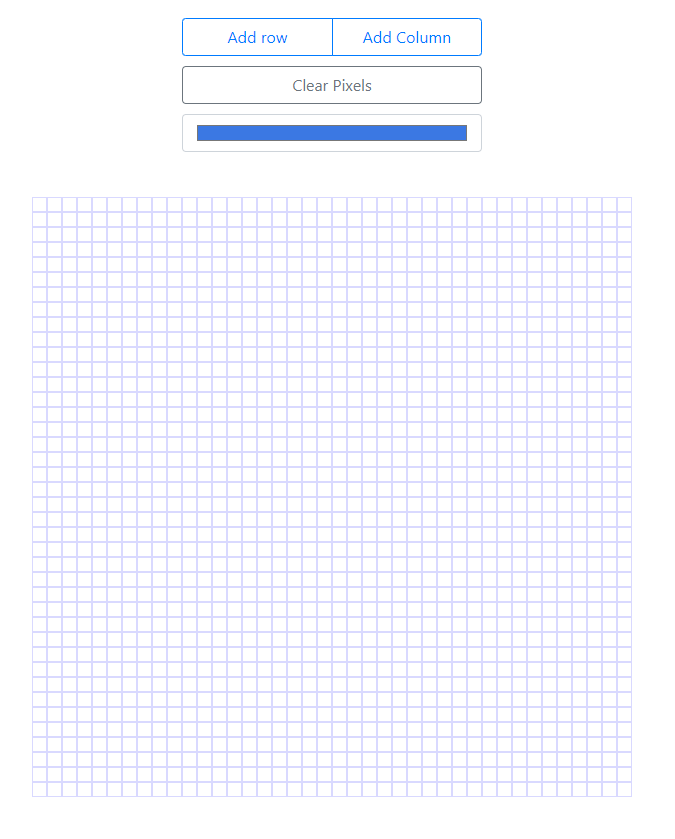
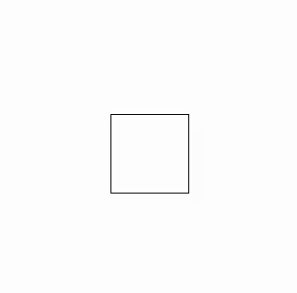

<style type="text/css" rel="stylesheet">
    :not(pre) > code[class*="language-"] {
        padding: .1em 5px;
        border-radius: 0;
        font-size: 80%;
        background: rgba(0,0,0,0.15);
        color: black;
    }

    pre[class*="language-"]{
        font-size: 14px;
    }

    p img{
      display: block;
      margin: auto;
    }

    img[alt="Pixel Drawer using Angular"]{
      max-width: 100%;
    }

    .gatsby-highlight-code-line{
      display: block;
      background-color: #5f5f5f;
    }

    @media(max-width: 767px){
      pre[class*="language-"]{
        font-size: 12px;
      }
    }
</style>

I’ve always felt that small projects, as simple as they might seem, are a great way to learn or reinforce one’s knowledge of a technology or framework. Although one might feel that his or her effort might be wasted working on something that might not be significant, small projects provide great insight that can be extremely beneficial later in one’s career. 

In this blog post, I will document the process of building a simple pixel drawer with Angular.



## Overview
The pixel drawer will have minor functionality and will be composed of four key pieces:
1. `App component` will hold the pixel-board component along with the controls needed to add columns and rows, change color, and clear the board.
2. `Pixel-fill` directive will be an attribute directive that will be responsible for changing the color of the pixel.
3. `Pixel service` will store state that is needed across the different components that make up the application.
4. `Pixel-board` component will contain references to the pixel directives as well as methods and variables that give the board shape and functionality.

## App component
I want to keep this project as simple as possible so I only plan on adding three controls that will provide some needed functionality:
1.	Add row/column
2.	Clear pixels
3.	Color selector

The add row/column and clear pixel controls will be buttons with `onclick` listeners. The color selector control will be an input with an `onchange` listener with the event being passed as a parameter to capture the selected color. We'll worry about binding the click listener methods later.

```html
<!-- app.component.html -->

 <div class="controls">
    <div class="btn-group">
        <button class="btn btn-outline-primary" (click)="addRow()">
            Add row
        </button>
        <button class="btn btn-outline-primary" (click)="addCol()">
            Add Column
        </button>
    </div>
    <button class="btn btn-outline-secondary" (click)="onClearBoard()">
        Clear Pixels
    </button>
    <input 
        type="color" 
        class="form-control" 
        (change)="onColorChange($event)" 
        value="#ffffff"
        >
</div>

```

## Pixel-Fill Directive
The `pixel-fill` directive will be an attribute directive that is one of three types of directives found in Angular and is responsible for changing the appearance or behavior of a DOM element.

For now, the only thing the pixel-fill directive will do is change the color of the pixel and clear the pixel. This will be done by adding the `mouseenter` event listener that will change the color of the pixel when the mouse hovers over it, and a `clearPixel()` method that will change the color to `#fff`.

```typescript
/**
 * pixel-fill.directive.ts
 */ 
import { Directive, HostListener, ElementRef } from '@angular/core';
import { PixelService } from './pixel.service';

@Directive({ selector: '[pixelFill]' })

export class PixelFillDirective {

    constructor(
        private elRef: ElementRef
    ) { }

    @HostListener('mouseenter') onHover(){
        this.elRef.nativeElement.style['background-color'] = "blue";
    }

    clearPixel(){
        this.elRef.nativeElement.style['background-color'] = "#fff";
    }

}

/**
 * app.component.html
 */
<div pixelFill style="width: 50px; height: 50px; border: 1px solid black;"></div>


```



It works! But the color is hard coded, so let’s change that.

### Communicating between components

The color is controlled by the app component, so the `pixel-fill` directive does not have direct access to it, which means that some sort of component communication must be put in place. When it comes to this topic in Angular, just like many other programming problems, there are multiple approaches one can take to arrive at the same place. 

One way to pass the color from the app component to the directive is to pass down the color as an `@input` to the directive. While that is a valid approach, let’s use a service, for as you will see later on, we will add some extra properties to the service that will be essential to the application. 

## Pixel Service
A service in Angular is simply a function that can be injected into multiple components across the application. They are a great way to share data across components at different levels of the application. In this case, the pixel service will have the `providedIn: 'root'` option, which means the service will be provided at the top level of the application, ensuring that all components will get the same instance of the service.

For now, the only field in the pixel service will be the current color that is selected in the app component. This service will need to be injected in both the `app component` and the `pixel-fill` directive.

```typescript
/**
 * pixel.service.ts
 */
import { Injectable } from '@angular/core';

@Injectable({providedIn: 'root'})

export class PixelService {

    currentColor = '';

    constructor() { }

}

/**
 * In pixel-fill.directive.ts
 */
export class PixelFillDirective {

    constructor(
        private elRef: ElementRef,
        private pixelService: PixelService //highlight-line
    ) { }

    @HostListener('mouseenter') onHover(){
        this.elRef.nativeElement.style['background-color'] = this.pixelService.currentColor; //highlight-line
    }
    
    @HostListener('mousedown') onMouseDown(){
        this.elRef.nativeElement.style['background-color'] = this.pixelService.currentColor; //highlight-line
    }

    clearPixel(){
      this.elRef.nativeElement.style['background-color'] = "#fff";
    }  

}

/**
 * In the app.component.ts
 */
export class AppComponent implements OnInit {

  ngOnInit(){
  }

  constructor(
    private pixelService: PixelService //highlight-line
  ){}

  addCol(){ }

  addRow(){ }

  onClearBoard(){ }

  onColorChange(event){
    this.pixelService.currentColor = event.target.value; //highlight-line
  }

}
```

## Pixel Board
The pixel board will serve as a container for all the `pixel-fill` directives that will be added to the DOM, so its job is to instantiate all the pixels when the application starts.It should contain all the methods and properties that will determine the size of the board and implement some needed functionality. 

Also, it must keep a reference of the `pixel-fill` directives so that it can access the methods defined in the directive, which is another way to provide component communication. This can be done by using the `@ViewChildren` decorator which will store the references to the `pixel-fill` directive. In this case, the only `pixel-fill` method that the pixel-board will access is `clearPixel()`. 

### Calculating board and pixel size
A pixel’s size is determined by the readonly `PIXEL_SIZE` which is applied directly to the `div` using Angular’s `ngStyle` directive, which allows one to apply dynamic styles to an element. The height and width of the board will be calculated by multiplying `PIXEL_SIZE` by the number of rows and columns respectively.

### Initializing the board
To render the board with pixels, we will have to create a loop that will iterate the DOM to add all the `pixel-fill` directives. To solve this, let’s create an array filled with arrays and fill those arrays with 0’s. This is the resulting `pixel-board` code.

```typescript
import { 
    Component, 
    OnInit, 
    ViewChildren, 
    QueryList, 
    Input, 
    HostListener } from '@angular/core';

import { PixelFillDirective } from '../pixel/pixel-fill.directive';

@Component({
  selector: 'pixel-board',
  template: `
    <div 
        class="board" 
        [ngStyle]="{'height.px': PIXEL_SIZE*rows, 'width.px': PIXEL_SIZE*cols}"
        >
      <ng-container *ngFor="let pixelRow of pixelBoard">
          <ng-container *ngFor="let pixel of pixelRow">
            <div 
                class="pixel" 
                [ngStyle]="{'height.px': PIXEL_SIZE, 'width.px': PIXEL_SIZE}" 
                pixelFill
                >
            </div>
          </ng-container>
      </ng-container>
    </div>
  `,
  styleUrls: ['./pixel-board.component.scss']
})

export class PixelBoardComponent implements OnInit{

  readonly PIXEL_SIZE = 15;
  cols = 40;
  rows = 40;
  pixelBoard: Array<Array<any>>;

  @ViewChildren(PixelFillDirective)
  pixelsRef: QueryList<PixelFillDirective>;

  constructor() { }

  ngOnInit() {
    this.pixelBoard = new Array(this.rows);
    for(let i = 0; i < this.rows; i++){
      this.pixelBoard[i] = new Array(this.cols).fill(0);
    }
  }

  addColumn(){
    this.cols += 1;
    this.pixelBoard.forEach(pixelRow=>{
      pixelRow.push(0);
    });
  }

  addRow(){
    this.rows += 1;
    this.pixelBoard.push(new Array(this.cols).fill(0));
  }
  
  clearPixels(){
    this.pixelsRef.forEach(pixel=>{
     pixel.clearPixel();
    });
  }

}

```
### Connecting the controls
The methods for adding rows/columns and clearing the pixels currently live inside the `app component`. These methods need to access the methods inside the `pixel-board` that are responsible for changing the state of the board. 

Using the `@ViewChild` with the `PixelBoardComponent` as a parameter and storing in it a variable will give us a reference to that component. This will allow the app component to access all the public methods found in the `pixel-board` component. With that done, the `pixel-board` has full functionality.

```typescript
export class AppComponent implements OnInit {

  //highlight-start
  @ViewChild(PixelBoardComponent, {static: false})
  pixelBoard: PixelBoardComponent;
  //highlight-end

  ngOnInit(){
  }

  constructor(
    private pixelService: PixelService
  ){}

  addCol(){
    this.pixelBoard.addColumn(); //highlight-line
  }

  addRow(){
    this.pixelBoard.addRow(); //highlight-line
  }

  onClearBoard(){
    this.pixelBoard.clearPixels(); //highlight-line
  }

  onColorChange(event){
    this.pixelService.currentColor = event.target.value;
  }

}
```

It’s done! Or is it? 

Although we can now resize, clear, and draw across the board, there is still one major function left to implement. Currently, a pixel is being filled every time the mouse hovers over it. To make this a true pixel drawer, a user has to “click and drag” to draw on the board.

## Click and Drag
At the moment, the pixels are being filled every time the mouse hovers over a particular pixel. The desired behavior is of a typical drawing application where the user must click and hold down the mouse button, then drag it over the board in order to fill the pixels. This is an essential part of the application. Again, there are probably countless ways of replicating this behavior, but I think we should use something that is already in place — time to revisit the `pixel-service`.

### Adding the “clicked” field to pixel service

Since every component where the service is used will receive the same instance of the service, I think it’s a perfect place to add a variable to keep track of when the mouse button is down. This variable can then be used in other components, such as the `pixel-directive`, to determine whether a pixel should be filled when the mouse is hovered over it.

Let’s add a private variable with the name `_clicked` along with its corresponding getter and setter. Now, we just need to use that variable in some of the methods located in the `pixel-fill` directive. 

```typescript
/**
 * pixel.service.ts
 */
export class PixelService {

    private _clicked = false; //highlight-line
    currentColor = '';

    constructor() { }

    get clicked(){
        return this._clicked;
    }

    set clicked(value: boolean){
        this._clicked = value
    }

}

/**
 * pixel-fill.directive.ts
 */
export class PixelFillDirective {

    constructor(
        private elRef: ElementRef,
        private pixelService: PixelService
    ) { }

    @HostListener('mouseenter') onHover(){
        if(this.pixelService.clicked){ //highlight-line
            this.elRef.nativeElement.style['background-color'] = this.pixelService.currentColor;
        }
    }
    
    @HostListener('mousedown') onMouseDown(){
        this.elRef.nativeElement.style['background-color'] = this.pixelService.currentColor;
        this.pixelService.clicked = true; //highlight-line
    }

    @HostListener('mouseup') onMouseUp(){
        this.pixelService.clicked = false; //highlight-line
    }

    clearPixel(){
        this.elRef.nativeElement.style['background-color'] = "#fff";
    }

}
```

So on `mousedown` the value of click will be set to true. In the `mouseenter` host listener, we will now make sure that the value of `clicked` is true before filling the pixel. To cancel the “click and drag” effect, we have to set the value of `clicked` to false at some point, so we will add a `mouseup` listener that will do just that.

Alright, now we’re done! Or are we?

There is still one small issue, which is that the `clicked` field is not set to false when the mouse leaves the board. This is because there is no host listener on the pixel directive that will set the `clicked` value to false. 

### Adding a hostlistener to the pixel board

Adding a `mouseleave` host listener to the pixel would not work, as the value would always be set to false upon the mouse leaving the pixel. This would cancel the “click and drag” function. 

So instead, we will inject the pixel-service to the pixel-board component and add the `mouseleave` hostlistener which will set the value of `clicked` to false when the mouse leaves the board. 

```typescript
/**
 * pixel-board.component.ts
 */
export class PixelBoardComponent implements OnInit{

    @HostListener('mouseleave')
        onMouseLeave(){
        this.pixelService.clicked = false;
    }
}
```

Finished?! For now...

## Closing Thoughts
I think using a service for component communication might have been a bit of an overkill for this project. But I do believe that using the service will ultimately make the application more flexible and easier to modify in future iterations. What are your thoughts?

As you can see, even with a small project such as this one, a developer must make many design and architecture decisions. One will most likely have to comb through the documentation along the way. 

I encourage everyone to build a simple project like this one because even the smallest projects will often challenge one’s knowledge of the technology or framework in use.

<p>
  <a href="https://pixeldrawer.z13.web.core.windows.net/" target="_blank">
    Check out the project here!
  </a>
</p>

<p>
  <a href="https://github.com/Diegodlt/pixel-drawer-angular" target="_blank">
    Check out the source code!
  </a>
</p>
